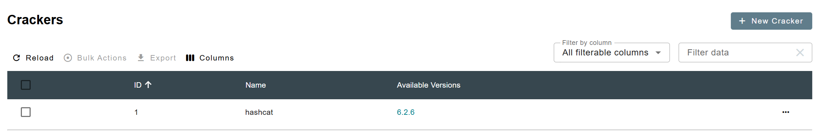

# Binaries

Hashtopolis is also responsible of the update and distribution of several binaries, starting from the cracker, e.g. Hashcat, or also the binaries for the agent. This part of the manual is dedicated to the management of those binaries from the corresponding menu.

## Crackers

When Hashtopolis was first developed it was solely designed to manage hashcat tasks with multiple agents. As part of the evolution of the project, support for other tool than hashcat was integrated in hashtopolis. In addition to the support of different tools, hashtopolis can also manage different versions of the same tool. 

<figure markdown="span">
    { width="600" }
</figure>

This page displays some basic information about all the crackers configured in hashtopolis. Apart from the ID of the cracker and its name, the version(s) available is also displayed. Hashtopolis is configured with a default hashcat cracker to be downloaded by the agents whenever they need it. 

### Creating a New Cracker

As mentioned above, Hashtopolis supports other crackers than Hashcat. To deploy a new cracker, two steps are required, first the creation of the type of cracker and then adding a version for it. 

By clicking on the ``*New Cracker*'' button, a new page opens in which you can set the name for the new cracker and declare if the chunking is available for this cracker. In order to be compatible with chunking, a cracker must have the following features:

- **--keyspace**: calculate the size of the task to be distributed.
- **--skip**: define the starting point from where the hashcat instance should start working on the keyspace.
- **--limit**: define how many entries from the keyspace should be evaluated by the hashcat instance.

In other words, the keyspace is the total amount of work related to a task. The combination of skip and limit will define a portion of the keyspace, also called chunk, on wich an agent will be working. That is the main features required to distribute a task among the several agents.

If chunking is not available for a cracker, then a task cannot be split and it must be run by a single agent. WHen selecting such type of cracker during the task creation, the ["small task"](./tasks.md#advanced-parameters) flag will be enabled by default. 

> [!CAUTION]
> Creating a new type of cracker is not a simple plug-and-play process with Hashtopolis. In addition to defining the new cracker type, you must also modify the agent itself. Specifically, this involves writing a dedicated Python handler file for your cracker.
>
> An example handler, generic_cracker.py, is available in the agent-python Git repository and can serve as a starting point. However, adapting it to your needs will likely require a solid understanding of how the agent communicates with the server and processes tasks. Once your custom handler is ready, you must also update the agent's main file to properly register and include it.

### Adding a New Version

Whether it is the first version for a new cracker or to update an existing cracker, the page displayed below for adding a version to a cracker will appear. 

<figure markdown="span">
    { width="400" }
</figure>

The three following information are required to deploy a new version.

- **Binary Base Name**: this is how the cracker should be called from the command line by the agent. In our example, the hashcat cracker is called with ```hashcat'''. 
- **Binary Version**: the version number of the cracker should be inserted here. The backend will order them in decreasing order. The latest version will be selected by default for this cracker.
- **Download URL**: this specifies from where the agent should download the binary package. In the case of our example, it is directly downloaded from the hashcat webpage. 

> [!NOTE]
> The agents may not have access to the location of the cracker, e.g. in the case of an offline system. One solution is to store the cracker package in a folder of the main server that is reachable by the agents. Then use this for the URL so that the agent can reach it and download it when needed.
>

## Preprocessors

The purpose of a pre-processor in the context of hashcat is to generate passwords candidates that are then fed through the standard input to a hashcat process. The preprocessor page displayed below list all the preprocessors configured in hashtopolis. 

<figure markdown="span">
    { width="600" }
</figure>

By default hashtopolis is installed with a single preprocessor, namely [*Prince*](https://github.com/hashcat/princeprocessor). Additional preprocessors can be added by clicking the *New Preprocessor" button. The creation page below is diplayed.

<figure markdown="span">
    { width="600" }
</figure>

It is rather similar to the creation of a new version of a [cracker](./crackers_binary.md#adding-a-new-version). The main difference is that the user can associate the required keyspace, skip, and limit options to different flags of the preprocessor. Note that those three remain mandatory to be used within hashtopolis, however, this allows more flexibility as the preprocessor may have named those options differently. If additional paramaters are required at execution time, they should be included in the [preprocessor's command](./tasks.md#advanced-parameters) during the task creation.


## Agent Binaries

There are several situations where deploying a new Hashtopolis agent binary is necessary. Most commonly, this happens when official updates introduce bug fixes, performance improvements, or support for new features. However, you may also need to build or modify an agent binary yourself—for example, if you've developed a custom cracker that requires integration via a new Python handler, or if you need a version of the agent compiled specifically for another platform such as Windows. In all cases, updating the agent typically involves replacing the existing binary and ensuring any dependencies are still met.

The agent binaries page displayed the information shown below about the current agent binaries configured in hashtopolis.

<figure markdown="span">
    { width="600" }
</figure>

To create a new agent, simply press the button *New Binary* in the agent binary page. The following page is then displayed.

<figure markdown="span">
    { width="400" }
</figure>

The following fields need to be filled at creation time.

- **Type**: This field is used to provide information about the agent binaries such as for example the programming language in which it is written.
- **Operating Systems**: specifies the list of OSs supported by the agent.
- **Filename**: specifies the filename of the agent binaries.
- **Version**: specifies the version of the agent binaries
- **Update Track**: this can be either stable or release. It specifies the status of the current agent.

**To be reviewed**
- Are the two first fields free text zones or they are checked and linked to something?
- What it the update track field needed for... for information purpose ?
- WHere does one store the agent... I guess it should be in the folder binaries of hashtopolis, but so it means it has to be uploaded manually and therefore we should have an explanation about this or to have an upload / url functionality.