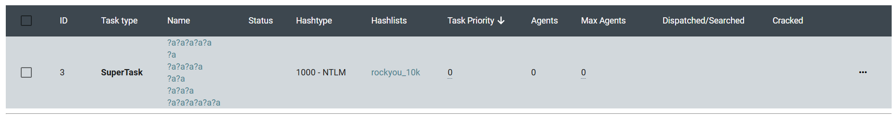
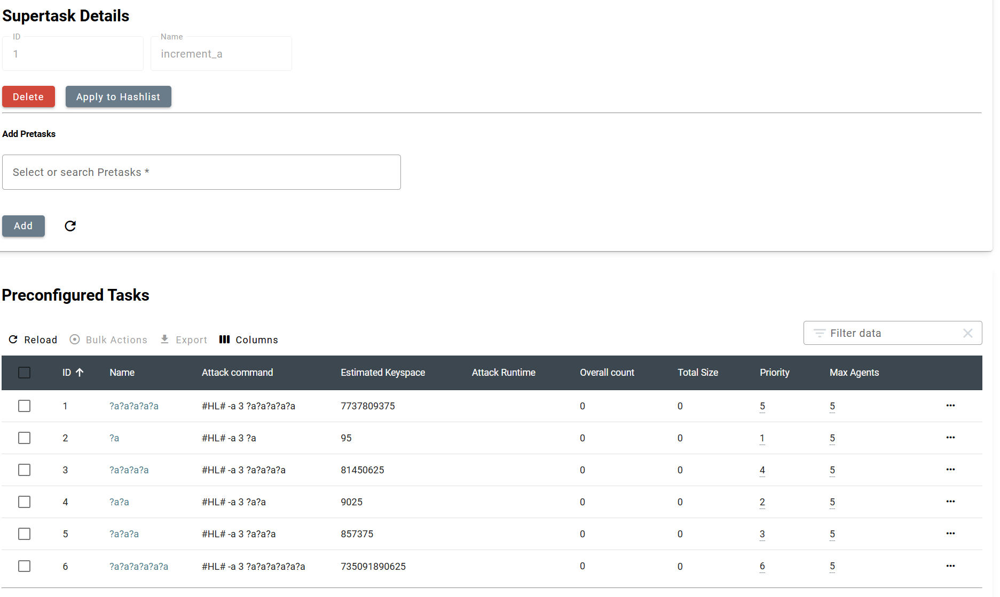

# Tasks

Tasks are central to Hashtopolis operations. They define how password cracking jobs are executed. Each task specifies the attack configuration, including the hashlist, required files (such as wordlists or rules), and the command line for Hashcat. This page explains how to create, configure, and manage tasks.

## Task Creation

To create a new task, click on the button "+ New Task" on the *Tasks > Show Task* page. A window will open where you can enter the task details. Some fields are required, while others are filled in with default values.

### Basic Parameters

1. **Name**: Provide a name for the task you want to create. This name will be shown during [task monitoring](./tasks.md#task-overview) and should be descriptive enough for easy identification.

2. **Hashlist**: Select the hashlist you want this task to target. Tasks are ordered by their IDs. [SuperHashlists](./hashlist.md#super-hashlists) are at the bottom of the list ordered by their respective IDs.

3. **Command Line**: Provide the attack command to be executed by the agent. The placeholder #HL# represents the hashlist and is automatically replaced with the correct path during execution. Do not remove or replace it manually. For example, to perform a 6-digit mask attack, use: ```#HL# -a3 ?d?d?d?d?d?d```. For a dictionary attack with rules, select the necessary files from the right-side panel. Selecting a rule file automatically includes it and the '-r' flag in the command line.

4. **Priority**: Assign an integer value. Agents are assigned to tasks based on descending priority. A task with priority 0 will not run unless an agent has been manually assigned and no higher priority tasks are available, or if the related setting is modified (["Settings > Task/Chunk > Automatic Assignment of Tasks with Priority 0"](./settings_and_configuration.md#command-line-misc)). Default is 0.

5. **Maximum number of agents**: Limits how many agents can work on the task. A value of 0 allows unlimited agents. Useful to reserve part of your cluster for specific tasks

6. **Task Notes** - *optional*: Add extra information about the task or command line here. 

7. **Color** - *optional*: Assign a color in hex format (e.g., #RRGGBB). Default is white (#FFFFFF). Helps visually distinguish tasks during monitoring.

### Advanced Parameters

These additional task configuration options allow greater control over execution and resource usage.

8. **Chunk size**: Defines the expected processing time for each chunk<span title="A portion of the keyspace assigned to an agent for cracking. If an agent fails or a chunk times out, it will be reassigned.">ℹ️</span> of this task. Default value is set in [Settings](./settings_and_configuration.md#benchmark-chunk).

9. **Status timer**: How often agents report task progress to the server. Default value is set in [Settings](./settings_and_configuration.md#activity-registration).

10. **Benchmark Type**: Choose the benchmarking method, usually *Speed Test* is the most suitable one. For large salted lists, "Runtime" may be more appropriate.

11. **Task is CPU only**: Limits this task to agents flagged as [CPU-only](./agents.md#agent-overview).

12. **Task is small**: If this flag is enabled, a single agent can be assigned to this task. This is relevant for small tasks or to assign the full keyspace in a single chunk to an agent. Note that this is **NOT** equivalent to define the *Maximum number of agents* to 1. Indeed, in this latter case, the task will still be divided in chunks according to the *chunk size* parameter. The flag is disabled by default.

13. **Binary type to run the task**: Specify the binary type and version to use for this task. Defaults to the latest available in the [Binaries](./crackers_binary.md#crackers) section. 

14. **Set as preprocessor task**: Such option allows the usage of a preprocessor. By default hashtopolis is installed with a single preprocessor, namely [*Prince*](https://github.com/hashcat/princeprocessor). Additional preprocessors can be defined in the [*preprocessors*](./crackers_binary.md#preprocessors) page. The command that should be used for this preprocessor must be defined in the free text zone below. A task define with a preprocessor will result in the execution of the preprocessor redirecting the output as stdin for the command line defined above in the same task. This allows the usage of "external" candidate generator such as Prince.  

15. **Skip a given keyspace at the beginning of the task**: Assign an integer value X. Skips the first X candidates in the keyspace, equivalent to adding *-s X* in the Hashcat command. Useful for resuming from a previous partial run.

16. **Use Static Chunking**: If this option is enabled, the regular division in chunk (based on the chunktime and the benchmark of the agent) will be ignored. An alternative division is used depending of the choice made.
  - *Fixed chunk size*: Divides the keyspace in chunks of the provided length. The last chunk of the task may be smaller for completion.
  - *Fixed number of chunks*: Divides the keyspace uniformly into the specified number of chunks.


## Task Overview

Valuable information on the current tasks is displayed in the Task Overview. In addition to the classic information such as individual ID or the type of task, the overview offers further highlights. The most important ones are described in more detail below:

- Status: The current number of password candidates attempted per second is shown in a **live status**. If the task has been completed, this is indicated by a **visual tick**; if the task is not currently running, it is in **idle** status.

- Dispatched/Searched: As already described in **What is Hashtopolis**, a part of the keyspace is distributed. It is therefore very common that not 100% of the keyspace is distributed directly. This information is communicated to us at this point. The search space is always smaller than the dispatched value because Hashtopolis distributes the chunk first and then starts the password search. **Searched** shows the percentage of the entire chunk/keyspace that has already been searched.

- Cracked: If a password is found during the attack, this is displayed with a 1, for example (if the number of passwords found is higher, this is correspondingly more). Clicking on the number then displays the plain text password, among other things.

<figure markdown="span">
    
</figure>


## Preconfigured tasks

A **preconfigured task** is a reusable template not yet linked to a hashlist. This is useful for defining frequently used tasks like standard mask attacks or dictionary attacks. Once created, the preconfigured task can be reused without needing to re-enter its settings.

When creating a *new preconfigured task*, you will see a subset of the fields used for regular tasks. Refer to the [Task Creation](./tasks.md#task-creation) section for more details.

After creation, the new preconfigured task appears on the Preconfigured Tasks page. You can set its default priority and maximum number of agents. These defaults will be applied when generating a task from the template.

You may delete a preconfigured task or use one of the two actions below:

- **Copy to task**: Opens a *New Task* form with all values pre-filled from the preconfigured task. Just choose the target hashlist and adjust other values as needed. 

> [!TIP]
> A task can also be generated from a preconfigured task directly from the *Hashlist Details*.

- **Copy to Pretask**: Opens the *New Preconfigured Task* form pre-filled with the values from the existing preconfigured task for easy editing. This is useful for making slight adjustments—such as updating a mask or swapping a rule file without recreating it from scratch.


#### Creating a preconfigured task from a task

On the Show Tasks page, each task has an action called *Copy to Pretask*. This creates a preconfigured task pre-filled with the values from the existing task, including its name. You can modify those values before saving.

## Super Task
A **SuperTask** is a collection of preconfigured tasks. When applied to a hashlist, it creates all the individual tasks included in the group. A SuperTask is handled differently by both the front-end and the back-end. As such, the monitoring is slightly different as explained below.

> [!CAUTION] 
> Supertasks cannot be applied to superhashlists. 

Supertasks are ideal for defining consistent cracking strategies which can be used repeatedly with multiple hashlists.

### New SuperTask

A new supertask can be created from the *SuperTask* page by clicking on the *+ New* button. In the following page, give a name to the supertask and select all the preconfigured tasks to include. Click the "Create SuperTask" button to finalize.

### Overview

The **SuperTask menu** shows a list of all supertasks and their associated preconfigured tasks. The following options are available:

- **Apply to Hashlist**: Select a target hashlist and binary in the opened page. This action creates all the sub-tasks from the supertask to the selected hashlist.
- **Show/Hide**: Expands the supertask view to show the included subtasks with their details:
  - **ID**: Preconfigured task ID.
  - **Name**: Clickable name to open and view the subtask details. 
  - **SubTask Priority**: Controls subtask execution order within the supertask (higher = first).
  - **SubTask Max Agents**: Limits the number of agents per subtask.
  - **Remove**: Removes the subtask from the supertask but doesn't delete it unless initially imported via "Import SuperTask".

### SuperTask in the *ShowTasks* Menu

Supertask are not displayed as regular tasks in the *Show Task* menu as displayed in the picture below. 


<figure markdown="span">
    
</figure>

The same information than those of a task are displayed. The *copy to Pretask* and *copy to task* options are not available. There is instead an information button which open a pop-up window displaying the list of subtasks of the supertask. This window is identical to the ShowTasks page apart that only the subtasks of the supertask are displayed in it as shown in the figure below. 

<figure markdown="span">
    
</figure>

## SuperTask Builder

The **SuperTask Builder** menu offers functionalities to create SuperTasks and the related pre-configured task in an easy manner. There exist two different ways to create those supertasks, *Masks* and *Wordlist/Rule bulk*.

### Masks

This functionality allows the user to create a supertask from a mask file or a set of masks. It is a good alternative to replace the --increment option of hashcat that cannot be use in hashtopolis.

- **Name**: Defines the name that will be given at the created SuperTask
- **Are small tasks**: If this parameter is set to yes, a single agent can be assigned to the tasks that will be created when the resulting supertask is apply to a hashlist. This is relevant for small tasks or to assign the full keyspace in a single chunk to an agent. Note that this is **NOT** equivalent to define the *Maximum number of agents* to 1. Indeed, in this latter case, the task will still be divided in chunks according to the *chunk size* parameter. The parameter is set to No by default.
- **Max Agents**: Specify the maximum agents that can be assigned to the tasks that will be created when the resulting supertask is apply to a hashlist. If this amount is reached, future available agents will be assigned to the next task available with a lower priority even if the all the chunks of the task have been distributed. The default value of 0 means that there is no maximum and therefore, all available agents are assigned to this tasks until all the chunks have been distributed. This functionality is helpful to only use a portion of the cluster for a specific task, and therefore allowing to split the workers on different tasks.
- **Are CPU tasks**: If this parameter is set to yes, only the agents that are declared as CPU only can be assigned to this task. More details can be found in the [agent section](./agents.md) of this manual. The parameter is set to No by default. 
- **Use Optimized flag (-O)**: If this parameter is set to Yes, the optimized flag -O will be added to the command line of all the sub-tasks of this supertask. The -O flag in Hashcat enables the use of optimized kernels for better performance. This improves cracking speed yet it has an impact on some aspects such as limiting the maximum length of the candidates to be tested, e.g. from 256 to 55 in the case of MD5 or from 256 to 27 for NTLM. 
- **Benchmark Type**: Select which benchmarking type should be used for the subtasks of the supertask. It is recommended to use the default *Speed Test* for mask attack. Only in few cases, such as tasks with big salted lists, the *Runtime* may be used.
- **Cracker Binary which is used to run this task**: This parameter specifies the binary type to use for this specific task. 
- **Insert Masks**: The mask lines that will generate the subtask should be written here. The expected format is the one of a *.hcmask" file for hashcat. In a nutshell, there should be one mask per line following the format **[?1,][?2,][?3,][?4,]mask**, where [?x] specifies the optional charset that can be used in the mask. More details can be found [here](https://hashcat.net/wiki/doku.php?id=mask_attack).

A subtask will be created for each line of the the *Insert masks* text zone and they will be grouped in a supertask. The subtasks are pre-configured task from the database point of view, however they are not displayed in the *Preconfigured Tasks* page. The subtasks that will be generated in this supertasks will be ordered accordingly to their order in the *Insert masks* text zone giving the highest priority to the first line.

> [!NOTE]
> Note that the options above will be applied to all the pre-configured tasks that will be created during the generation of the supertasks from this build.

### Wordlist/Rule bulk

The wordlist/Rule bulk functionality allows to create a set of subtasks for an iteration of several files selected by the user. It allows for example to create an attack strategy of a succession of wordlists to be applied one after the other or to use different rule files with a single wordlist. 

Most of the options are identical to those of the Mask supertask creation. The main difference is that the *Insert Masks* is obviously not present and is replaced by the *Base Command* option. In this text zone the user is expected to type the command line that should be iterated. Similarly to the *New Task* page, *#HL#* is filled in by default in the command line. It is a placeholder for the hashlist and will be replaced automatically at execution time by the agent with the correct path to the hashlist file. The user then need to select the Rules and Wordlist to use in the supertask. When selecting a file as a base - wether a Rule file, a wordlist or other - the file is immediately added at the command line like in a regular task creation. 

Multiple files are expected to be selected as "Iterate". They should be of the same type (rules/wordlists/other), yet this functionality allows to select different type of files. The placeholder **FILE** should be manually placed by the user. During creation of the supertask, one subtask is created for each file selected as iterate replacing the FILE placeholder by one of the "Iterate File". 

Similarly to a regular task, any hashcat parameter can be added to the command line. For example, if the user wants that the Optimized Kernel option (-O) is used, it should be added. That is the reason why this option is not offered to the user among the options contrary to the *Build Masks*.


**MAKE AN EXAMPLE WITH SOME FIGURES**

> [!CAUTION]
> If the iteration is done over rule files, the flag **-r** will not be added when FILE is replaced by the rule file. It should therefore be added in the command line as displayed in the example above. 
