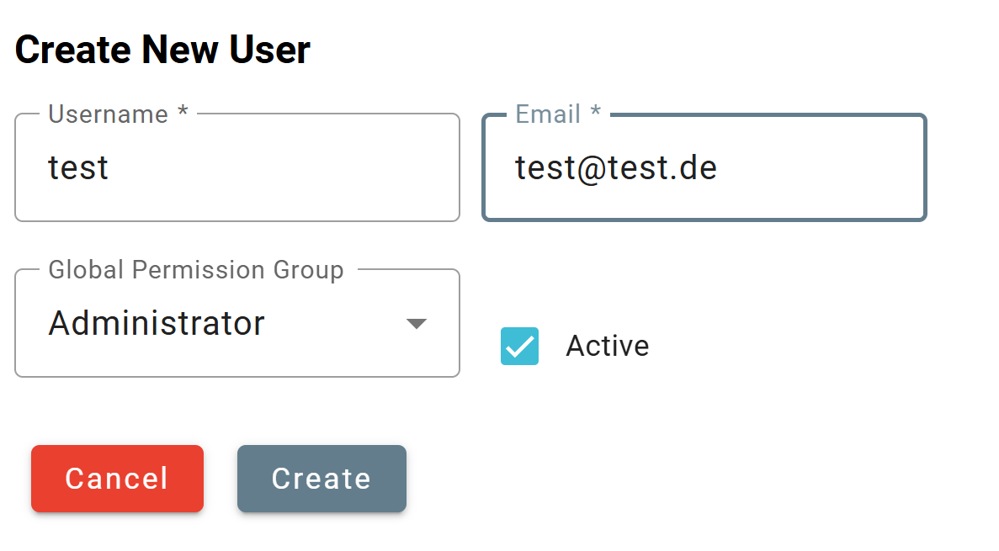
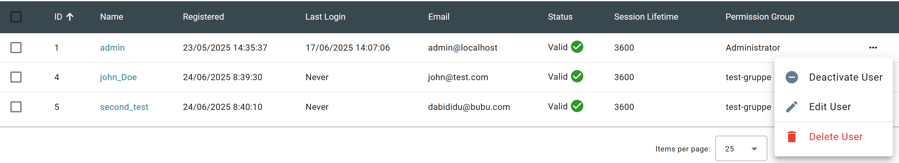

# Users

## All Users

Hashtopolis is a multi-user platform so it is possible to create and manage new users.

In the **user area** there is an overview which shows all relevant information about the created users:

For example, the last login date and the associated permission group are tracked.

### Creating a new User

Click on the **+ New User** button to create a new user which will open the user creation page as displayed below. You can then specify a user name and the corresponding e-mail address. In addition, the user must be given appropriate rights, i.e. assigned to a so-called permission group

<figure markdown="span">
    { width="600" }
</figure>

### Edit user to set a password

If an email server has not been properly set, it is necessary for the admin to set a password for the newly created user to give her the possibility to login. To do this, click on **edit-user** in the action field for this user as depicted on the picture below. A freely chosen password can then be set. The newly created user can now log in with a user name and password. The rights that the user has are defined in the corresponding permission group and determine which areas will be visible and editable for the new user (see the [Access management](users.md#access-management) section).

<figure markdown="span">
    { width="600" }
</figure>

In addition, users can be deactivated. A deactivated user can no longer log in. He will receive the error message **Check Credentials**. Deactivated users can be reactivated at any time by an admin.

## Access Management  

The tool offers the possibility to define broad and very detailed access authorizations not only at user level. In the Access Group Management of Hashtopolis we distinguish between two essential components. On the one hand the so-called **Global Permissions** and on the other hand the **Access Groups**. Both areas can be found under the **Users** menu item.

### Global Permissions
The very first step is to create the global permission group. This can be easily created using the **+ New** button. Only a name is initially selected in the creation step.

In the second step, the authorizations of the created permission group must be defined. To do this, simply click on **Edit Permission Group** in the overview area. We can now define which rights the global permission group should have for the individual access areas. We differentiate here between the **Create**, **Read**, **Update** and **Delete** events. Depending on the access area, there are dependencies, for example it is partly predefined that the authorization **Create Agent** must also receive the authorization **Reg Voucher**, as the two processes are technically linked. Nevertheless, authorizations can be defined in fine granularity.

We now drag the link to the user administration. Each user must be a member of a permission group, which is selected when the user is created. This ensures that the user has defined authorizations at all times and can only see the areas that are intended. It is important to note that a user can only be a member of a single permission group. The permission group can be changed via the settings under **Edit User**. The individual members of a permission group can be viewed under **Edit Permission Group**. This logic also means that a permission group can only be deleted when no more users belong to it, so that it has been ensured that the users have been transferred to another permission group.

### Access Groups
In the global permissions, we have defined what rights users are generally allowed to have. For example, creating an agent or registering a voucher. The access groups now define the specific objects on which these rights can be executed. Let's do an example of this:

When creating a hash list, I have to define which access group this hash list is assigned to. As a user with the global permission **Create Task,** I can now only see the hash list when creating the task if I am also a member of the corresponding access group. The Access Group can therefore regulate who can see, use and work with which files.
The same applies to the agents. I can therefore use the access groups to control who gets which access to my computing resources.

In contrast to the permission groups, a user can be a member of none, one or more access groups in order to keep the options offered by Hashtopolis as flexible as possible.

To create a new Access Group, click on **New Access Group**. As with the global permissions, only a name is initially defined here.
The group can then be edited in more detail.
To edit the group, click on **Edit Access Group** in the overview area again. I can now specify which user and which agent should be added to this access group. Please note the following: When an agent is created, it is automatically assigned to the **default** Access Group. If I want to change this, it must be done here. The reason for this is that the owner of an agent should not change the assignment to an Access Group. Otherwise, an agent owner could make this setting in the agent details.

Let's explain this in more detail using a practical example: When a task is created, the access group is derived from the associated hashlist, as an access group must be selected when the hashlist is created. Now Hashtopolis looks at which agents are in my access group and the task is only distributed to the agents in the corresponding access group. Agents outside the access group would not be addressed. Of course, it is possible that an agent is a member of different access groups, so it is possible that agents are still busy with tasks from other access groups.

